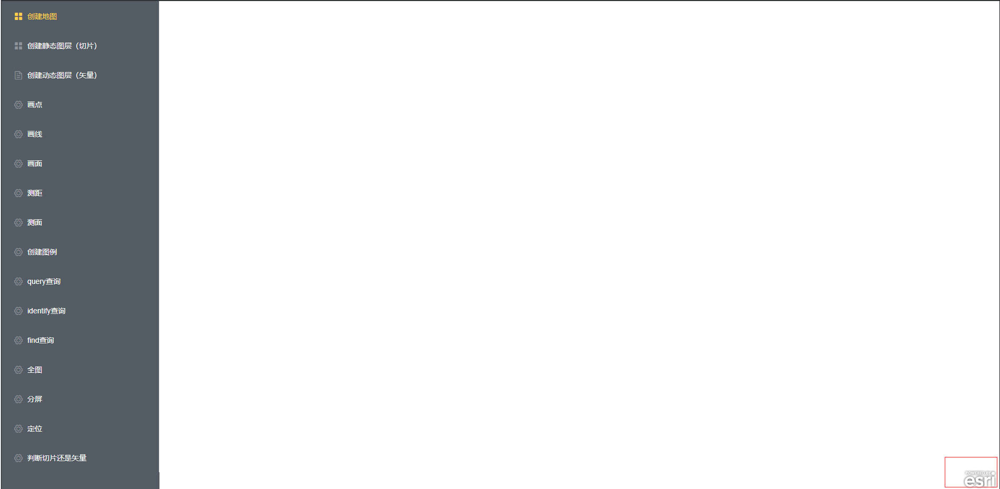
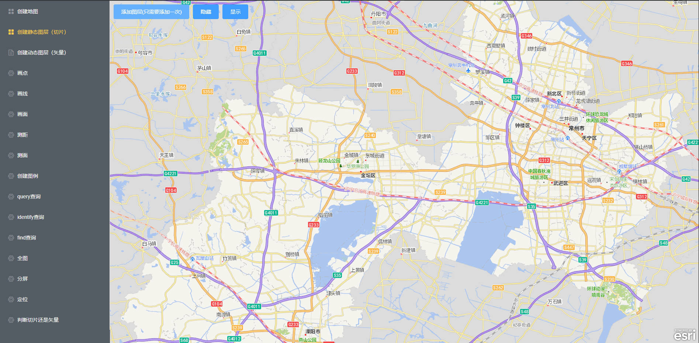

# ArcGis For JavaScriptApi 文档

## 开始 - 准备工作

> 安装esri-loader@3.7.0
>
> 安装配置 Element-ui
>
> 安装配置 vue-router

## 开始

::: code-group

```vue [1.创建地图容器]
<temlete>
  <!-- createMap.vue -->
  <div class="map" id="map" ref="map"></div>
</temlete>
<script>
export default {
  data() {
    return {
      map: "",
    };
  },
  methods: {},
  mounted() {},
};
</script>
```

```js [2.封装地图依赖url，js，css]
// @/config/map.js
const mapUrl = "http://www.czch.com.cn:8184"; //
const popupUrl = mapUrl + "/popups"; //国家电子底图
const esriJs =
  "http://www.czch.com.cn:8184/arcgis_js_api/library/3.30/3.30/init.js"; //基础js
const esriCss = mapUrl + "/arcgis_js_api/library/3.30/3.30/esri/css/esri.css"; //基础css
//http://192.168.1.6:8399/arcgis/rest/services/CzsjtlyMap_compact/MapServer

const czdzUrl =
  "https://arcgis-waf.qj-xc.cn:6443/arcgis/rest/services/CZ_Vector/MapServer"; //常州电子底图
const czdzMarkUrl =
  "https://arcgis-waf.qj-xc.cn:6443/arcgis/rest/services/CZ_Vector_Anno/MapServer"; //常州电子底图-标记
const czdzImageMarkUrl =
  "http://58.216.48.11:6080/arcgis/rest/services/Image_2021/MapServer"; //常州影像底图-标记
// 没有常州影像-标记底图
const computeUrl =
  "http://58.216.48.11:6080/arcgis/rest/services/Utilities/Geometry/GeometryServer"; //这个服务是用来计算距离的
const xingzhengUrl =
  "http://www.czch.com.cn:6080/arcgis/rest/services/DJT_XZJX/MapServer"; //行政区域的服务
const testUrl =
  "http://www.czch.com.cn:6080/arcgis/rest/services/jkws_base/MapServer"; //(动态图层)测试服务
const serverUrl =
  "http://www.czch.com.cn:6080/arcgis/rest/services/DJT/MapServer"; //宗地，地籍，地籍子区的服务

const EPSG = 4490; //空间参考系，因为地球不是一张平面，而是被铺成了一张平面，必须使用坐标系来精确定位

// 初始化地图所展示的范围，矩形区域
const EXTENT = {
  xmin: 118.7042822445701,
  ymin: 31.046740023691534,
  xmax: 120.9270752928116,
  ymax: 32.33481673514486,
};
const BORDERCOLOR = [0, 0, 255]; // 全局边框(线条)颜色
const FILLCOLOR = [205, 209, 211, 0.5]; // 全局填充颜色
export {
  esriJs,
  esriCss,
  czdzUrl,
  czdzImageMarkUrl,
  czdzMarkUrl,
  popupUrl,
  computeUrl,
  xingzhengUrl,
  testUrl,
  serverUrl,
  EPSG,
  EXTENT,
  BORDERCOLOR,
  FILLCOLOR,
};
```

```js [3.封装创建地图方法]
// @/api/createMap.js
import * as esriLoader from "esri-loader"; //加载arcgis依赖
// 导入默认坐标和初始化区域
import { EPSG, EXTENT } from "@/config/map";

// 创建地图
// 需要参数：地图容器 - mapContainer、地图范围 - mapExtent
const createMapApi = async (mapContainer, mapExtent) => {
  console.log("准备创建地图");
};

export default createMapApi;
```

```vue [4.导入依赖]
// createMap.vue
<script>
// 导入arcgis依赖esri-loader
import * as esriLoader from "esri-loader";
// 引入所需的js,css
import { esriJs, esriCss } from "@/config/map";
// 加载js
esriLoader.loadScript({ url: esriJs });
// 加载css
esriLoader.loadCss(esriCss);
// 创建地图
import createMapApi from "@/api/createMapApi";
export default {
  data() {
    return {
      map: "",
    };
  },
  methods: {
    async createMap() {
      const _this = this;
      if (_this.map === "") {
        // createMapApi()两个参数 地图容器，范围
        _this.map = await createMapApi(_this.$refs.map);
      }
    },
  },
  mounted() {
    this.createMap();
  },
};
</script>
```

```js [5.createMapApi核心代码]
import * as esriLoader from "esri-loader"; //加载arcgis依赖
// 导入默认坐标和初始化区域
import { EPSG, EXTENT } from "@/config/map";

// 创建地图
// 需要参数：地图容器 - mapContainer、地图范围 - mapExtent
const createMapApi = async (mapContainer, mapExtent) => {
  console.log("准备创建地图");
  const _this = this;
  // Map - ArcGis核心组件 - 用作渲染
  // Extent - 一个二维平面上的矩形区域，用来定义地图的可视范围或空间查询范围
  // SpatialReference - 对象，地理空间信息
  // ArcGISTiledMapServiceLayer - 图层
  const [Map, Extent, SpatialReference, ArcGISTiledMapServiceLayer] =
    await esriLoader.loadModules([
      "esri/map",
      "esri/geometry/Extent",
      "esri/SpatialReference",
      "esri/layers/ArcGISTiledMapServiceLayer",
    ]); //加载所需的arcgis组件
  // 定位位置
  const sp = new SpatialReference(EPSG);
  if (mapExtent === undefined) {
    // 说明没有传extent过来
    // 那么便使用默认的范围
    mapExtent = EXTENT;
    mapExtent.spatialReference = {
      wkid: EPSG,
    };
  } else {
    // 有extent传过来
    if (mapExtent.spatialReference === undefined) {
      mapExtent.spatialReference = {
        wkid: EPSG,
      };
    }
  }
  // 准备地图显示区域
  const _extent = new Extent(mapExtent);
  let map = new Map(mapContainer, {
    logo: true, // 是否在地图右下角显示esri的logo，默认true
    slider: false, // 是否显示左上角放大缩小的滑块，只有叠加静态或者动态图层后才显示，默认true
    spatialReference: sp, // 加上空间坐标系
    extent: _extent, // 设置地图初始范围
    zoom: 11, // 设置地图缩放等级，越大离地面越近(一般最大20)
    minZoom: 10, // 设定地图的最小缩放等级
  });
  return map;
};

export default createMapApi;
```

:::

此时就可以看到控制台打印了

> 准备创建地图

并且仔细看的话，页面中也出现一个 logo - `esri` 说明地图加载成功，只是因为没有传 extent，所以什么都没有显示

如图：

到此为止，前期准备工作已完成。下面便是如何去使用...

## 创建静态图层（切片）

> 1.创建地图
>
> 2.创建静态图层
>
> 3.添加静态图层

::: code-group

```vue{5,41-47,54-55,63} [1.创建地图]
<templete>
 <!-- createTileLayer.vue -->
 <div class="container">
    <!-- 地图容器开始 -->
    <div class="map" id="map" ref="map"></div>
    <!-- 地图容器结束 -->
    <!-- 工具栏开始 -->
    <div class="toolBar">
      <el-button type="primary" @click="addTileLayer">添加图层(只需要添加一次)</el-button>
      <el-button type="primary" @click="hideMarkLayer">隐藏</el-button>
      <el-button type="primary" @click="showMarkLayer">显示</el-button>
    </div>
    <!-- 工具栏结束 -->
  </div>
</templete>
<script>
// 加载arcgis依赖
import * as esriLoader from "esri-loader";
// 引入所需要的参考系，url，js，css
// czdzUrl - 常州电子地图
// czdzMarkUrl - 常州电子地图(标记)
import { esriJs, esriCss, czdzUrl, czdzMarkUrl } from "@/config/map";
import createTileLayerApi from "@/api/createTileLayerApi";
import createMapApi from "@/api/createMapApi";
esriLoader.loadScript({ url: esriJs }); //加载js
esriLoader.loadCss(esriCss); // 加载css
export default {
  data() {
    return {
      map: "", //地图
      layer1: "", // 图层1
      layer2: "", // 图层2
    };
  },
  methods: {
    // 创建静态切片图层
    // 静态切片图层一般固定几个,不太会变化
    async createTileLayer() {
      const _this = this;
      if (_this.map === "") {
        // 地图初始化
        // 第一步创建地图
        _this.map = await createMapApi(_this.$refs.map);
        // 第二步创建静态地图
        _this.layer1 = await createTileLayerApi(czdzUrl);
        // 第三步将静态地图添加到map上 - 也叫叠图
        _this.map.addLayer(_this.layer1);
      }
    },
    // 添加图层
    async addTileLayer() {
      const _this = this;
      if (_this.layer2 === "") {
        _this.layer2 = await createTileLayerApi(czdzMarkUrl);
        _this.map.addLayer(_this.layer2);
      }
    },
    // 隐藏标记图层
    async hideMarkLayer() {
      const _this = this;
      if (_this.layer2 !== "") {
        // hide方法隐藏指定图层
        _this.layer2.hide();
      }
    },
    // 显示隐藏图层
    async showMarkLayer() {
      const _this = this;
      if (_this.layer2 !== "") {
        // show()方法显示指定图层
        _this.layer2.show();
      }
    },
  },
  mounted() {
    this.createTileLayer();
  },
};
</script>

<style lang="scss" scoped>
.container {
  width: 100%;
  height: 100%;
  position: relative;

  .map {
    width: 100%;
    height: 100%;
  }
  .toolBar{
    position: absolute;
    top: 10px;
    left: 10px;
  }
}
</style>
```

```js{5-9,11} [2.创建静态图层]
// createTileLayer.js
import * as esriLoader from "esri-loader"; //加载arcgis依赖类，必须
// 创建静态图层（矢量，一般是底图）
// 需要参数: 1、layerUrl:静态图层的url
const createTileLayerApi = async (layerUrl) => {
  const _this = this;
  const [ArcGISTiledMapServiceLayer] = await esriLoader.loadModules([
    "esri/layers/ArcGISTiledMapServiceLayer",
  ]);//加载所需的arcgis组件

  let tileLayer = new ArcGISTiledMapServiceLayer(layerUrl); //创建静态图层

  return tileLayer;
}

export default createTileLayerApi;
```
:::

如此便添加了静态图层

如图 

### 组件、方法

::: info 提示：
上面出现了一些组件和方法，相信光看名字，都能猜到方法的作用，下面就稍微简介一下
:::

不管是组件还是方法都来自esri-loader

### 组件

> Map - ArcGis核心组件 - 用作渲染
>
> Extent - 一个二维平面上的矩形区域，用来定义地图的可视范围或空间查询范围 - `指定当前区域`
> 
> SpatialReference - 对象，地理空间信息
>
> ArcGISTiledMapServiceLayer - 静态图层服务 - `传入一个图层地址可以将图层叠加到地图上`

### 方法

`针对于地图的方法 - map`
> addLayer() - 叠图，可以将图层叠加到map上 - 用法`_this.map.addLayer(图层名称)`

`针对于图层的方法 - layer`
> hide() - 隐藏指定图层 - 用法`_this.layer.hide()`
>
> show() - 显示指定图层 - 用法`_this.layer.show()`

## 创建动态图层（矢量）

::: info 提示
创建动态图层本质上跟创建静态图层没有多大的区别，依然遵循基本的创建流程
:::

<strong style="color:red">步骤：</strong>

> 1.创建地图
>
> 2.创建叠加静态图层
>
> 3.创建叠加动态图层


vue部分基本和上面的一模一样，唯一不一样的是js中使用的方法`ArcGISDynamicMapServiceLayer`

::: code-group

~~~vue [createDynamicLayer.vue]
<!-- 创建地图 -->
<templete>
  <div class="container">
    <!-- 创建地图容器 -->
    <div class="map" id="map" ref="map"></div>
    <!-- 创建工具栏 -->
    <div class="toolbar">
      <el-button type="primary" @click="addLayer">添加</el-button>
      <el-button type="primary" @click="hideDynamicLayer">隐藏</el-button>
      <el-button type="primary" @click="showDynamicLayer">显示</el-button>
    </div>
  </div>
</templete>
<script>
// 导入Arcgis依赖
import * as esriLoader from "esri-loader";
// 加载所需要的js，css，url，参考系
import { esriJs, esriCss, czdzUrl, xingzhengUrl, szgjUrl } from "@/config/map";
// 加载css、加载Js
esriLoader.loadScript({ url: esriJs });
esriLoader.loadCss(esriCss);
// 导入加载地图底图
import createMapApi from "@/api/createMapApi";
// 加载静态地图
import createTileLayer from "@/api/createTileLayerApi";
// 导入加载矢量图层
import createDynamicLayerApi from "@/api/CreateDynamicLayerApi";
export default {
  data() {
    return {
      map: "", // 底图
      layer1: "", // 静态图层
      layer2: "", // 动态图层
    };
  },
  methods: {
    // 创建地图
    async createMap() {
      const _this = this;
      if (this.map === "") {
        // 1.创建底图
        _this.map = await createMapApi(_this.$refs.map);
        // 2.创建图层
        _this.layer1 = await createTileLayer(czdzUrl);
        // 3.叠加图层
        _this.map.addLayer(_this.layer1);
      }
    },
    // 添加动态图层
    async addLayer() {
      const _this = this;
      if (this.layer2 === "") {
        // 创建动态图层
        _this.layer2 = await createDynamicLayerApi(xingzhengUrl);
        _this.map.addLayer(_this.layer2);
      }
    },
    // 隐藏动态图层
    hideDynamicLayer() {
      const _this = this;
      if (_this.layer2 !== "") {
        _this.layer2.hide();
      }
    },
    // 显示动态图层
    showDynamicLayer() {
      const _this = this;
      if (_this.layer2 !== "") {
        _this.layer2.show();
      }
    },
  },
  mounted() {
    this.createMap();
  },
};
</script>
<style lang="csss" scoped>
.container {
  width: 100%;
  height: 100%;
  position: relative;
  .map {
    height: 100%;
    width: 100%;
  }
  .toolBar {
    position: absolute;
    top: 10px;
    left: 12px;
  }
}
</style>
~~~

~~~js [createDynamicLayerApi.js]
// 创建动态图层Api
import * as esriLoader from "esri-loader"; //加载arcgis依赖类，必须
// 创建静态图层（矢量，一般是底图）
// 需要参数: 1、layerUrl:静态图层的url
const createTileLayerApi = async (layerUrl) => {
  const _this = this;
  // 加载动态图层服务
  const [ArcGISTiledMapServiceLayer] = await esriLoader.loadModules([
    "esri/layers/ArcGISTiledMapServiceLayer",
  ]);//加载所需的arcgis组件
  let tileLayer = new ArcGISTiledMapServiceLayer(layerUrl); //创建静态图层

  return tileLayer;
}

export default createTileLayerApi;
~~~

::: tip 细节
细心的人已经发现，和创建静态图层(切片)不一样的创建动态图层的一点是，组件加载的图层服务不一样。
::: 

### 组件

> ArcGISDynamicMapServiceLayer() - 加载动态图层服务组件 - 参数，动态图层url地址