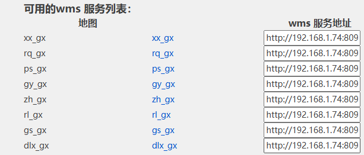

# 在 arcgis 中使用超图服务

api：

> "esri/layers/WMSLayer"
>
> "esri/layers/WMSLayerInfo"

```js
const [
  Map,
  Extent,
  SpatialReference,
  GraphicsLayer,
  WMSLayer,
  WMSLayerInfo,
  ArcGISTiledMapServiceLayer,
  ArcGISDynamicMapServiceLayer,
] = await esriLoader.loadModules([
  "esri/map",
  "esri/geometry/Extent",
  "esri/SpatialReference",
  "esri/layers/GraphicsLayer",
  "esri/layers/WMSLayer",
  "esri/layers/WMSLayerInfo",
  "esri/layers/ArcGISTiledMapServiceLayer",
  "esri/layers/ArcGISDynamicMapServiceLayer",
]); //加载所需的arcgis组件
const extent = {
  xmin: 118.7042822445701,
  ymin: 31.046740023691534,
  xmax: 121.3270752928116,
  ymax: 32.33481673514486,
  spatialReference: {
    wkid: EPSG,
  },
};
let wms = "http://192.168.1.74:8090/iserver/services/map-cssmx_gx/wms111";
let layer1 = new WMSLayerInfo({
  name: "rq_gx", // 图层名称 - 
  title: "Rivers",
  spatialReferences: [4490],
});

let resourceInfo = {
  extent: _extent, // 参数：xmin,ymin,xmax,ymax,spatialReferences
  layerInfos: [layer1],
  spatialReferences: [4490], // 坐标规范 - 4490
  version: "1.1.1", //wms版本号
};

let wmsLayer = new WMSLayer(wms, {
  resourceInfo: resourceInfo,
  version: "1.1.1",
  visibleLayers: ["rq_gx"], // 选择加载的图层 - 根据图层名称
});
map.addLayer(wmsLayer);
```
