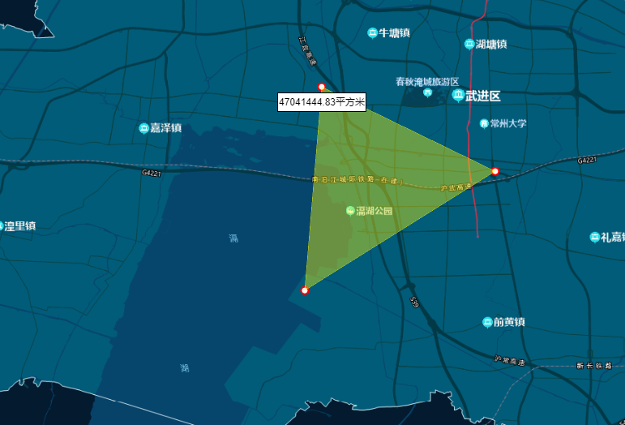

# Mapbox开发文档

## 一、搭建环境

官方文档：https://docs.mapbox.com/mapbox-gl-js/guides/install/

正常情况是根据官方的安装教程进行安装，不过官方教程刚需token，token需要申请较为麻烦，所以我们开发都采用绕过token验证的方式。

绕过token的方式也很简单，只需要在mapbox-gl.js这个文件中修改部分代码。不过我们不用每次都改，直接去老项目里复制


这两个文件即可。

复制进来这两个文件之后，再在index.html中导入即可

```
<link async rel="stylesheet" href="./js/mapbox-gl.css" />
<script src="./js/mapbox-gl.js"></script>
```

## 二、核心功能

### （1）创建地图

html需要一个宽度和高度都确定的div盒子。


下面代码创建了一个基础的地图，包含天地图底图和天地图注记。

```
const _this = this;
//天地图底图，地址可能需要更新
var tdtVec = {
  //类型为栅格瓦片
  type: "raster",
  tiles: [
    //请求地址
    "https://onenet.jscz.org.cn:8088/czmap/midscr/chycydthlw/serverproxy/proxy137/iserver/services/map-ugcv5-GreenMap4490221113/wms111?service=WMS&version=1.1.1&request=GetMap&layers=0&style=&format=image/png&transparent=true&epsg-4490&width=256&height=256&srs=EPSG:4490&bbox={bbox-epsg-4490}",
  ],
  //分辨率
  tileSize: 256,
};
//天地图注记，地址可能需要更新
var tdtCva = {
  //类型为栅格瓦片
  type: "raster",
  tiles: [
    "https://onenet.jscz.org.cn:8088/czmap/midscr/chycydthlw/serverproxy/proxy137/iserver/services/map-ugcv5-GreenAnno4490221113/wms111?service=WMS&version=1.1.1&request=GetMap&layers=0&style=&format=image/png&transparent=true&epsg-4490&width=256&height=256&srs=EPSG:4490&bbox={bbox-epsg-4490}",
  ],
  tileSize: 256,
};
_this.map = new mapboxgl.Map({
  container: "map", //地图容器div的id
  center: [119.83217178446182, 31.785486024305555], //地图中心点
  zoom: 9, //初始缩放级别
  // 设置具体的地图样式，这里需要自定义样式
  style: {
    //设置版本号，一定要设置，好像只能设置为8
    version: 8,
    //添加来源
    sources: {
      tdtVec: tdtVec,//天地图底图
      tdtCva: tdtCva,//天地图注记
    },
    layers: [
      {
        //图层id，要保证唯一性
        id: "tdtVec",
        //图层类型
        type: "raster",
        //数据源
        source: "tdtVec",
        //图层最小缩放级数
        minzoom: 7,
        //图层最大缩放级数
        maxzoom: 24,
      },
      {
        id: "tdtCva",
        type: "raster",
        source: "tdtCva",
        minzoom: 7,
        maxzoom: 22,
    }],
  },
});
```

如果没有出现问题，创建完成后效果如下。


清除地图的方法是remove()。

```
this.map.remove();
```

### （2）添加图层

除了上述在地图初始化时添加图层，也可以在地图加载完成后添加图层。

mapbox加载新图层的逻辑是，先添加数据源(Source)，再添加图层(Layer)。

```
this.map.addSource('sourceId', {
  type: "raster",
  tiles: [
    "https://onenet.jscz.org.cn:8088/czmap/midscr/chycydthlw/serverproxy/proxy137/iserver/services/map-ugcv5-GreenMap4490221113/wms111?service=WMS&version=1.1.1&request=GetMap&layers=0&style=&format=image/png&transparent=true&epsg-4490&width=256&height=256&srs=EPSG:4490&bbox={bbox-epsg-4490}",
  ],
  tileSize: 256,
});//数据源添加完成
this.map.addLayer({
  id: 'layerId',
  type: 'raster',
  source: 'sourceId',
});//图层添加完成
```

### （3）切换图层显示/隐藏

方法的第一个参数是图层id，第二参数固定，第三个参数（visible表示显示，none表示隐藏）。

```
this.map.setLayoutProperty(‘layerId’, 'visibility', 'visible');//显示图层
this.map.setLayoutProperty(‘layerId’, 'visibility', 'none');//隐藏图层
```

### （4）删除图层

参数是layerId。

```
this.map.removeLayer(layerId);
```

### （5）画点

#### 1、使用marker

##### 1-1、使用默认marker

创建marker，设置经纬度，加到地图上。

```
let marker = new mapboxgl.Marker()
    .setLngLat([120.090327864, 31.7114227660])
    .addTo(this.map);//创建marker并添加到地图上
```

效果如下


##### 1-2、使用marker-div填充

也可以自定义marker样式，使用div，然后设置div的样式即可。

```
let el = document.createElement('div');//首先创建一个div
el.style.width = '20px';//像平常设置css样式一样设置，宽度
el.style.height = '20px';//像平常设置css样式一样设置，高度
el.style.background = 'red';//像平常设置css样式一样设置，背景颜色
el.style.borderRadius = '50%';//像平常设置css样式一样设置，圆角
let marker = new mapboxgl.Marker(el)
    .setLngLat([119.83217178446182, 31.785486024305555])
    .addTo(this.map);//创建marker并添加到地图上
```

效果如下


##### 1-3、使用marker-图片

这是最常见的用法，就是使用自定义的图片当做marker标记。

```
let el = document.createElement('div');
el.style.width = '30px';
el.style.height = '30px';
// el.style.backgroundImage = 'url(http://www.pigpeiqi666.com/location.png)';//使用网络图片
el.style.backgroundImage = 'url(' + require('@/assets/point.png') + ')';//或者使用本地图片
el.style.backgroundSize = '100%';//size和backimage一起设置才有效
let marker = new mapboxgl.Marker(el)
    .setLngLat([119.93217178446182, 31.885486024305555])
    .addTo(this.map);//创建marker并添加到地图上
```

效果如下


##### 1-4、使用marker-文字

既然可以使用div自定义marker，那么我们就可以实现较复杂的文字标记。

```
let el = document.createElement('div');
el.style.background = 'rgba(27, 63, 105, 0.7)';
el.style.padding = '5px';
el.style.height = '52px';
el.style.display = 'flex';
el.style.alignItems = 'center';
el.style.color = '#fff';
el.style.cursor = 'pointer';
el.innerHTML = `<span style="
font-size: 16px;margin-right: 6px;font-weight: bold">溧阳市</span>
<div><div style="display: flex;align-items: center;margin-bottom: 5px"><span style="font-size: 14px;margin-right: 6px">隐患建筑</span>
<span style="font-family: Impact;
background: linear-gradient(180deg, #fff, #3bf);
-webkit-background-clip: text;
-webkit-text-fill-color: transparent;
font-size: 20px;margin-right: 6px">128</span>
<span style="font-size: 14px;">家</span></div>
<div style="display: flex;align-items: center;"><span style="font-size: 14px;margin-right: 6px">已整治</span>
<span style="font-family: Impact;
background: linear-gradient(180deg, #fff, #3bf);
-webkit-background-clip: text;
-webkit-text-fill-color: transparent;
font-size: 20px;margin-right: 6px">38</span>
<span style="font-size: 14px;">家</span></div></div>`;//设置innerHTML
let marker = new mapboxgl.Marker(el)
    .setLngLat([119.328987112, 31.4688297931])
    .addTo(this.map);
```

效果如下


##### 1-5、给marker添加popup

还有个常见需求，点击marker后弹出popup弹窗，展示详情。

```
let marker = new mapboxgl.Marker()
    .setLngLat([120.090327864, 31.7114227660])
    .addTo(this.map);//创建marker并添加到地图上
marker.setPopup(new mapboxgl.Popup()
.setHTML('<h3>我是标题</h3><p>我是内容</p>'));
```

效果如下


##### 1-6、清除marker

清除功能当然也是必要的。

```
marker.remove();//remove方法可以清除
```

建议创建同类marker时，放入同一个列表，然后就可以遍历删除了。

```
let marker = new mapboxgl.Marker()
    .setLngLat([120.090327864, 31.7114227660])
    .addTo(this.map);//创建marker并添加到地图上
this.logoMarkers.push(marker);//将创建的marker存放到数组中-方便清除

this.logoMarkers.forEach(item => {
	item.remove();
});
this.logoMarkers = [];
```

#### 2、使用layer

##### 2-1、使用layer绘制单点

涉及到layer逻辑就一样，先添加数据源，再添加图层。

```
this.map.addSource('point-1', {
  type: 'geojson',//GeoJSON 数据格式数据源
  data: {
    type: 'FeatureCollection',//表示多个具有几何和属性的要素的集合
    // 列表，每个元素都是一个Feature对象
    features: [{
      type: 'Feature',//类型始终为“Feature”
      geometry: {
        type: 'Point',//
        coordinates: [119.83917178446182, 31.715486024305555]
      },
    }]
  }
});
this.map.addLayer({
  id: 'layer-1',// 图层的唯一标识符，重复添加会报错
  type: 'circle',// 图层的类型，这里是圆形
  source: 'point-1',// 图层使用的数据源的id
  paint: {
    'circle-radius': 10,//设置圆的半径
    'circle-color': '#f00'//设置圆的颜色
  },// 图层的样式
});
```

效果如下


##### 2-2、使用layer绘制多点1

沿用上面画单点的逻辑，往列表里多放两个feature对象，即可画多点。

```
this.map.addSource('point-2', {
  type: 'geojson',
  data: {
    type: 'FeatureCollection',
    // 同时定义多个点
    features: [{
      type: 'Feature',
      geometry: {
        type: 'Point',// 可以是Point、MultiPoint、LineString、MultiLineString、Polygon、MultiPolygon
        coordinates: [119.83217178446182, 31.785486024305555]
      },
    },{
      type: 'Feature',
      geometry: {
        type: 'Point',// 可以是Point、MultiPoint、LineString、MultiLineString、Polygon、MultiPolygon
        coordinates: [119.93217178446182, 31.885486024305555]
      },
    },{
      type: 'Feature',
      geometry: {
        type: 'Point',// 可以是Point、MultiPoint、LineString、MultiLineString、Polygon、MultiPolygon
        coordinates: [119.73217178446182, 31.685486024305555]
      },
    }]
  }
});
this.map.addLayer({
  id: 'layer-2',// 图层的唯一标识符
  type: 'circle',// 图层的类型，这里是圆形,还有fill、line、symbol、fill-extrusion、raster、heatmap等
  source: 'point-2',// 图层使用的数据源的id
  paint: {
    'circle-radius': 10,
    'circle-color': '#00f'
  },// 图层的样式
});
```

效果如下


##### 2-3、使用layer绘制多点2

使用MultiPoint是绘制多点的另一个思路。

```
this.map.addSource('point-21', {
  type: 'geojson',
  data: {
    type: 'FeatureCollection',
    // 同时定义多个点
    features: [{
      type: 'Feature',
      geometry: {
        type: 'MultiPoint',// 使用MultiPoint，就可以同时放入多个点
        coordinates: [[119.88217178446182, 31.785486024305555], [119.87217178446182, 31.725486024305555], [119.76217178446182, 			31.685486024305555]]
      },
    }]
  }
});
this.map.addLayer({
  id: 'layer-21',// 图层的唯一标识符
  type: 'circle',// 图层的类型，这里是圆形circle,还有fill、line、symbol、fill-extrusion、raster、heatmap等
  source: 'point-21',// 图层使用的数据源的id
  paint: {
    'circle-radius': 10,
    'circle-color': '#00f'
  },// 图层的样式
});
```

效果如下


##### 2-4、使用layer绘制图片

这里的图片必须是被上传到服务器上的，本地图片无法被访问，所以不太好用。

```
 _this.map.loadImage('https://docs.mapbox.com/mapbox-gl-js/assets/cat.png', (error, image) => {
    if (error) throw error;
    _this.map.addImage('location', image);// 添加图片到地图上
    _this.map.addSource('point-3', {
    	type: 'geojson',
        data: {
          type: 'FeatureCollection',
          // 同时定义多个点
          features: [{
            type: 'Feature',
            geometry: {
              type: 'Point',
              coordinates: [119.83287178446182, 31.785486624305555]
            },
          },{
            type: 'Feature',
            geometry: {
              type: 'Point',
              coordinates: [119.99237178446182, 31.807486024305555]
            },
          }]
        }
    });
    // 确保没有该图层，避免重复点击
    _this.map.addLayer({
        id: 'layer-3',// 图层的唯一标识符
        type: 'symbol',// 图层的类型，这里是图形symbol
        source: 'point-3',// 图层使用的数据源的id
        layout: {
          'icon-image': 'location',// 图标的id，即上面addImage的第一个参数
          'icon-size': 0.25// 图标的大小,缩放比例
        }
    });
});
```

效果如下


##### 2-5、给layer添加popup

layer画出来的点，也有方法加上popup，来展示详情。

这次我们给画出来的点增加一些属性，用于等会弹窗中显示。

```
this.map.addSource('point-4', {
  type: 'geojson',
  data: {
    type: 'FeatureCollection',//表示多个具有几何和属性的要素的集合
    // 列表，每个元素都是一个Feature对象
    features: [{
      type: 'Feature',//类型始终为“Feature”
      geometry: {
        type: 'Point',// 可以是Point、MultiPoint、LineString、MultiLineString、Polygon、MultiPolygon
        coordinates: [119.73917178446182, 31.725486024305555]
      },
      properties: {//属性是一个对象
        title: '定位点-1',
        description: '我是弹窗内容-1'
      }
    },{
      type: 'Feature',//类型始终为“Feature”
      geometry: {
        type: 'Point',// 可以是Point、MultiPoint、LineString、MultiLineString、Polygon、MultiPolygon
        coordinates: [119.93987178446182, 31.725686024305555]
      },
      properties: {//属性是一个对象
        title: '定位点-2',
        description: '我是弹窗内容-2'
      }
    }]
  }
});//添加完成数据源
this.map.addLayer({
  id: 'layer-4',// 图层的唯一标识符，重复添加会报错
  type: 'circle',// 图层的类型，这里是圆形
  source: 'point-4',// 图层使用的数据源的id
  paint: {
    'circle-radius': 10,//设置圆的半径
    'circle-color': '#0f0'//设置圆的颜色
  },// 图层的样式
});//添加完成layer
```

下面给map增加，click点击事件，根据官方文档，mapbox的事件可以专门监听某个图层。

```
this.map.on('click', 'layer-4', function (e) {
var description = `<h3>${e.features[0].properties.title}</h3><div>${e.features[0].properties.description}</div>`;//自定义弹窗效果
new mapboxgl.Popup()
  .setLngLat(e.lngLat)
  .setHTML(description)
  .addTo(_this.map);
});
```

点击图层，效果如下


##### 2-6、清除点

使用layer画出来的点，清除自然就是清除图层的方法。

```
this.map.removeLayer('layer-4');
```

### （6）画线

#### 1、使用layer绘制多线1

和画点同理，画多线也有两种方式，具体根据数据源决定。

一种是多个LineString组成的列表。

```
this.map.addSource('line-1', {
  type: 'geojson',
  data: {
    type: 'FeatureCollection',//表示多个具有几何和属性的要素的集合
    // 列表，每个元素都是一个Feature对象
    features: [{
      type: 'Feature',//类型始终为“Feature”
      geometry: {
        type: 'LineString',// 
        coordinates: [[119.88887178446182, 31.788886024305555], [119.87887178446182, 31.728886024305555], [119.76887178446182, 			31.688886024305555]]
      },
    },{
      type: 'Feature',//类型始终为“Feature”
      geometry: {
        type: 'LineString',
        coordinates: [
          [119.00517178446182, 31.555486024305555], [119.20217178446182, 31.525486024305555], [119.10217178446182, 							31.655486024305555]
        ]
      },
    }]
  }
});
this.map.addLayer({
  id: 'layer-1',// 图层的唯一标识符，重复添加会报错
  type: 'line',// 图层的类型，这里是线,还有fill、line、symbol、fill-extrusion、raster、heatmap等
  source: 'line-1',// 图层使用的数据源的id
  paint: {
    'line-color': '#00f',// 线的颜色
    'line-width': 5,// 线的宽度
  },// 图层的样式
});
```

效果如下


#### 2、使用layer绘制多线2

另外一种是MultiLineString。

```
this.map.addSource('line-2', {
  type: 'geojson',
  data: {
    type: 'FeatureCollection',//表示多个具有几何和属性的要素的集合
    // 列表，每个元素都是一个Feature对象
    features: [{
      type: 'Feature',//类型始终为“Feature”
      geometry: {
        type: 'MultiLineString',// 注意这里有3层[]
        coordinates: [
          [[119.08217178446182, 31.585486024305555], [119.07217178446182, 31.525486024305555], [119.06217178446182, 						31.585486024305555]],
          [[119.08517178446182, 31.555486024305555], [119.25217178446182, 31.525486024305555], [119.15217178446182, 						31.655486024305555]]
        ]
      },
    }]
  }
});
this.map.addLayer({
  id: 'layer-2',// 图层的唯一标识符，重复添加会报错
  type: 'line',// 图层的类型，这里是圆形,还有fill、line、symbol、fill-extrusion、raster、heatmap等
  source: 'line-2',// 图层使用的数据源的id
  paint: {
    'line-color': '#0f0',// 线的颜色
    'line-width': 3,// 线的宽度
  },// 图层的样式
});
```

效果如下


### （7）画面

#### 1、使用layer绘制多面1

和画点，画线同理。

一种是多个Polygon组成的列表。

```
this.map.addSource("polygon-1", {
  type: "geojson",
  data: {
    type: "FeatureCollection", //表示多个具有几何和属性的要素的集合
    // 列表，每个元素都是一个Feature对象
    features: [
      {
        type: "Feature", //类型始终为“Feature”
        geometry: {
          type: "Polygon", // 注意这里有3层[]
          coordinates: [
            [
              [119.88887178446182, 31.788886024305555],
              [119.87887178446182, 31.728886024305555],
              [119.76887178446182, 31.688886024305555],
              [119.88887178446182, 31.788886024305555],
            ],
          ],
        },
      },
      {
        type: "Feature", //类型始终为“Feature”
        geometry: {
          type: "Polygon",
          coordinates: [
            [
              [119.00517178446182, 31.555486024305555],
              [119.20217178446182, 31.525486024305555],
              [119.10217178446182, 31.655486024305555],
              [119.00517178446182, 31.555486024305555],
            ],
          ],
        },
      }
    ],
  },
});
this.map.addLayer({
  id: "layer-1", // 图层的唯一标识符，重复添加会报错
  type: "fill", // 图层的类型，这里是圆形,还有fill、line、symbol、fill-extrusion、raster、heatmap等
  source: "polygon-1", // 图层使用的数据源的id
  paint: {
    "fill-color": "#ff0", //图层的填充色
    "fill-opacity": 0.6, //图层透明度
  }, // 图层的样式
});
```

效果如下


#### 2、使用layer绘制多面2

另一种是MultiPolygon。

```
this.map.addSource("polygon-2", {
  type: "geojson",
  data: {
    type: "FeatureCollection", //表示多个具有几何和属性的要素的集合
    // 列表，每个元素都是一个Feature对象
    features: [
      {
        type: "Feature", //类型始终为“Feature”
        geometry: {
          type: "MultiPolygon", // 注意这里有4层[]
          coordinates: [
            [
              [
                [119.08217178446182, 31.585486024305555],
                [119.07217178446182, 31.525486024305555],
                [119.06217178446182, 31.585486024305555],
                [119.08217178446182, 31.585486024305555],
              ],
            ],
            [
              [
                [119.08517178446182, 31.555486024305555],
                [119.25217178446182, 31.525486024305555],
                [119.15217178446182, 31.655486024305555],
                [119.08517178446182, 31.555486024305555],
              ],
            ],
          ],
        },
      },
    ],
  },
});
this.map.addLayer({
  id: "layer-2", // 图层的唯一标识符，重复添加会报错
  type: "fill", // 图层的类型，这里是圆形,还有fill、line、symbol、fill-extrusion、raster、heatmap等
  source: "polygon-2", // 图层使用的数据源的id
  paint: {
    "fill-color": "#fff", //图层的填充色
    "fill-opacity": 0.6, //图层透明度
  }, // 图层的样式
});
```

效果如下


### （8）测距

测距功能实现起来比较复杂，mapbox不像arcgis，arcgis自带“esri/toolbars/draw”，使用这个draw即可创建工具栏，并且绘制（点，多点，线，多线，面，多边形等等）图形。像测距这个功能，线画出来之后，再根据坐标点计算距离就很简单了。

而mapbox没办法这么方便，它没有类似draw工具，因此，画点画线之类的工作也需要使用监听函数自己实现（或者使用插件，没找到太好用的）。所以这块的实现代码较为复杂，可以去mapbox-study这个项目里看。


下面给出具体效果的展示，单击画点，双击完成。


可以通过点击轴点，来删除这个点，距离会重新计算。


### （9）测面

测面也需要完全自己实现，mapbox-study这个项目也有实现，可供参考。

*当前仍有问题，即如果面画的过大，缩放地图会出现图层样式缺失问题，暂未找到解决方法。


下面给出具体效果的展示，单击画点，双击完成。


可以通过点击轴点，来删除这个点，面积会重新计算。



### （10）地图打印

首先，在初始化地图时需要将preserveDrawingBuffer属性设置为true，默认是false。

官方文档如下


地图初始化

```
  this.map = new mapboxgl.Map({
    container: "map", //地图容器div的id
    center: [119.83217178446182, 31.785486024305555], //地图中心点
    zoom: 9, //初始缩放级别
    preserveDrawingBuffer: true, //设置为true，可以导出地图为图片
    // 设置具体的地图样式，这里需要自定义样式
    style: {
      //设置版本号，一定要设置，好像只能设置为8
      version: 8,
      //添加来源
      sources: {
      },
      layers: [],
    },
  });
```

打印代码

```
const canvas = this.map.getCanvas();
const imgURL = canvas.toDataURL("image/png");
const link = document.createElement('a');
link.href = imgURL;
link.download = 'map.png';
document.body.appendChild(link);
link.click();
document.body.removeChild(link);
```

### （11）绘制热力图

热力图用于显示特定区域的数据密度。mapbox自带type=heatmap，所以实现起来比较简单。

一般热力图的数据都很大，所以先处理数据。

数据格式如下


处理数据，添加source

```
  let features = CzHeatPoint.map((item) => {
    return {
      type: "Feature",
      geometry: {
        type: "Point",
        coordinates: [item.x, item.y],
      },
    };
  });
  this.map.addSource('heatmap-source', {
    type: 'geojson',
    data: {
      type: 'FeatureCollection',
      features: features
    }
  });//添加要素
```

然后重点就是添加layer

```
  this.map.addLayer({
    id: 'heatmap-layer',
    type: 'heatmap',//热力图类型
    source: 'heatmap-source',
    paint: {
      "heatmap-opacity": 0.8, // 热力图的不透明度（可选，取值范围为 0 ~ 1，默认值为 1）
      "heatmap-radius": 15, // 一个热力图点的影响半径（可选，值 >= 1，默认值为 30，单位：像素）
      "heatmap-weight": 1, // 一个热力图点的权重（可选，值 >= 0，默认值为 1）
      "heatmap-intensity": 0.6, // 热力图的强度，控制了所有的热力图点（可选，值 >= 0，默认值为 1）
      "heatmap-color": [ // 热力图的颜色变化（可选，默认值如下）
        "interpolate", ["linear"], ["heatmap-density"],
        0, "rgba(0,0,255,0)", 0.25, "rgb(0,0,255)", 0.55, "rgb(0,255,0)", 0.85, "yellow", 1.0, "rgb(255,0,0)"
      ]
    }
  })
```

效果如下


### （12）分屏

分屏的作用就是，可以同时打开2个（或者更多个）地图界面，来进行对比。
本次只展示2个屏的实现，更多屏同理。

分屏逻辑很简单，加载地图前，先准备好地图容器，然后加载两次地图即可。

```
  if(!_this.isSplit){
    // 开始分屏
    _this.isSplit = true;
    map.style.width = '50%';
    map2.style.width = '50%';
  } else {
    // 关闭分屏
    _this.isSplit = false;
    map.style.width = '100%';
    map2.style.width = '0%';
    // 销毁map2
    _this.map2.remove();
    _this.map2 = null;
  }
```

效果如下


在map2加载好之后，再给map1一个地图移动监听事件，让右侧可以跟着左侧移动。

```
_this.map.on('move', _this.onMapmove2);//增加地图移动监听事件
// 地图移动监听事件
onMapmove2(e) {
  console.log(e);
  // 获取主地图中心点和缩放
  let center = e.target.getCenter();
  let zoom = e.target.getZoom();
  // console.log(center);
  // 设置分屏地图中心点
  this.map2.jumpTo({center, zoom});
},//地图移动监听事件
```

### （13）卷帘

卷帘像是分屏功能的进阶版本，可以更清晰地对比相同地块的不同图层。

卷帘的逻辑如下。

html准备两个地图容器，和中间的可拖拽线。

```
<!-- 地图盒子1开始 -->
<div id="map"></div>
<!-- 地图盒子1结束 -->
<!-- 地图盒子2开始 -->
<div id="map2"></div>
<!-- 地图盒子2结束 -->
<!-- 中心拖动条开始 -->
<div id="swiper" v-if="showSwiper">
  <div class="imgDiv">
  </div>
</div>
<!-- 中心拖动条结束 -->

#map {
    position: absolute;
    left: 0;
    top: 0;
    width: 100%;
    height: 100%;
}

#map2 {
    position: absolute;
    left: 0%;
    top: 0;
    width: 0%;
    height: 100%;
}
```

先加载map1作为底图，然后在开始卷帘的时候，显示卷帘条，设置map2容器宽度，加载map2，并且给卷帘条增加拖拽监听事件。

```
  const _this = this;
  // 让中心卷帘可以左右拖动
  _this.showSwiper = true;
  _this.$nextTick(() => {
    let map2 = document.getElementById("map2");
    let swiper = document.getElementById("swiper");
    map2.style.width = (window.innerWidth - 200) + 'px';
    _this.initMap2();
    swiper.addEventListener('mousedown', e => {
      // console.log(e);
      document.onmousemove = (e2) => {
        // 更改swiper的left值，有最大值和最小值
        if(e2.clientX > 230 && e2.clientX < window.innerWidth - 30) {
          // swiper需要变化
          swiper.style.left = e2.clientX - 200 + 'px';
          // map2的宽度需要变化
          map2.style.width = e2.clientX - 200 + 'px';
        }
      }
      document.onmouseup = () => {
        document.onmousemove = null;
        document.onmouseup = null;
      }
    })
  });
```

加载map2时，定义两个移动监听事件，使map1移动时，map2可以同步移动，并且map2移动时，map1可以同步移动。

```
_this.map.on('move', _this.onMapmove2);//增加地图移动监听事件
_this.map2.on('move', _this.onMapmove);//增加地图移动监听事件

// 地图移动监听事件
onMapmove(e) {
  console.log(e);
  if(!e.originalEvent) {
    return;
  }
  // 获取主地图中心点和缩放
  let center = e.target.getCenter();
  let zoom = e.target.getZoom();
  // console.log(center);
  // 设置分屏地图中心点
  this.map.jumpTo({center, zoom});
},//地图移动监听事件
// 地图移动监听事件
onMapmove2(e) {
  console.log(e);
  // console.log(e.originalEvent);
  if(!e.originalEvent) {
    return;
  }
  // 获取主地图中心点和缩放
  let center = e.target.getCenter();
  let zoom = e.target.getZoom();
  // console.log(center);
  // 设置分屏地图中心点
  this.map2.jumpTo({center, zoom});
},//地图移动监听事件
```

更多详情请看mapbox-study代码。

效果如下。


### （14）定位

#### 1、飞行定位

有飞行动画，会飞过去。

```
  this.map.flyTo({
    center: [119.83217178446182, 31.785486024305555],//定位点
    zoom: 13,//缩放级别
  });
```

#### 2、直接定位

没有飞行动画，直接定位。

```
  this.map.jumpTo({
    center: [119.96563290004713, 31.79309636444132],//定位点
    zoom: 13,//缩放级别
  });
```

### （15）popup美化

mapbox自带的popup弹窗不太美观，我们可以自定义。

选择合适的背景图片，设置合理的间距样式即可。

```
::v-deep .mapboxgl-popup-content {
  position: relative;
  background-color: rgba(255, 255, 255, 0);//需要同时设置color和image
  background-image: url("@/assets/popup_bg.png");
  background-size: 100% 100%;
  padding: 24px;
}

::v-deep .mapboxgl-popup-close-button {
  color: #fff;
  font-size: 20px;
  right: 15px;
  top: 20px;
}

::v-deep .pop-title {
  margin: 5px;
  margin-left: 0px;
  font-weight: 800;
  font-size: 16px;
  text-align: left;
  color: #ffffff;
  background-image: url("@/assets/header-bg1.png");
  background-size: 160% 100%;
  padding: 5px 5px 5px 15px;
  // border: 1px solid #fff;
}
::v-deep .pop-content {
  text-indent: 2em;
  color: #ffffff;
  font-size: 13px;
  max-width: 240px;
  max-height: 220px;
  overflow-y: auto;
}
::v-deep .mapboxgl-popup {
  max-width: 1060px !important;
  // min-height: 220px;
  // max-width: 250px !important;
}
```

效果如下


